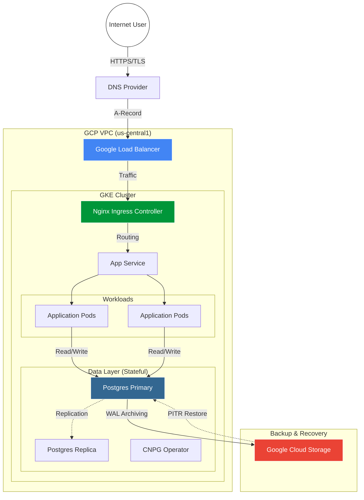
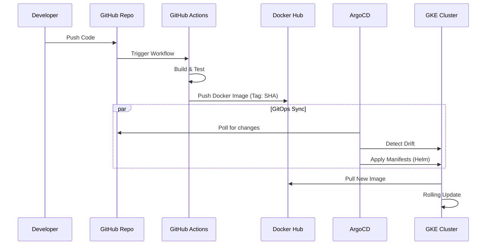

# ☁️ GCP Cloud-Native Platform


A production-grade, fully automated infrastructure platform built on **Google Cloud (GKE)**.
This project demonstrates a complete **DevOps lifecycle**, implementing Infrastructure as Code (IaC), GitOps, High Availability, and Disaster Recovery patterns.

---

## 🏗 Architecture Overview

The platform is designed with **security** and **reliability** in mind. It uses VPC-native networking, private subnets, and Workload Identity for passwordless authentication between Kubernetes and GCP services.



## 🛠 Tech Stack

| Domain | Technology | Implementation Details |
| :--- | :--- | :--- |
| **Cloud Provider** | Google Cloud Platform | VPC-native GKE, Cloud Router, Cloud NAT, GCS. |
| **IaC** | Terraform | Modular structure, Remote State in GCS with locking, IAM automation. |
| **Orchestration** | Kubernetes (GKE) | Managed Control Plane, Spot Instances for cost optimization. |
| **Package Mgmt** | Helm | Custom charts with subcharts (dependencies). |
| **CI/CD & GitOps** | GitHub Actions + ArgoCD | CI builds Docker images. ArgoCD syncs cluster state with Git. |
| **Database** | PostgreSQL (CloudNativePG) | Operator pattern, HA Cluster, S3 Backups (WAL Archiving). |
| **Security** | Cert-Manager | Automated Let's Encrypt SSL certificates (HTTP-01 challenge). |
| **Observability** | Loki Stack | Centralized logging (Promtail -> Loki -> Grafana). |

## 🚀 Deployment Pipeline (GitOps Flow)

We moved from imperative commands (`kubectl apply`) to a declarative **GitOps** model.



## 📂 Repository Structure

```text
├── terraform/             # Infrastructure as Code
│   ├── main.tf            # Network & Firewall definitions
│   ├── gke.tf             # Kubernetes Cluster configuration
│   ├── iam.tf             # Service Accounts & Workload Identity
│   └── storage.tf         # GCS Buckets for State & Backups
├── k8s/                   # Kubernetes Manifests
│   ├── charts/            # Custom Helm Charts
│   └── argocd/            # ArgoCD Application definitions
├── app/                   # Source Code (Python/Flask)
└── .github/workflows/     # CI Pipelines
```

## ⚡ Getting Started

This repository includes a comprehensive guide to bootstrapping the entire platform from scratch.

### 👉 [Read the Bootstrap Guide](BOOTSTRAP.md)

---
*Created by Sergei Filippov*
